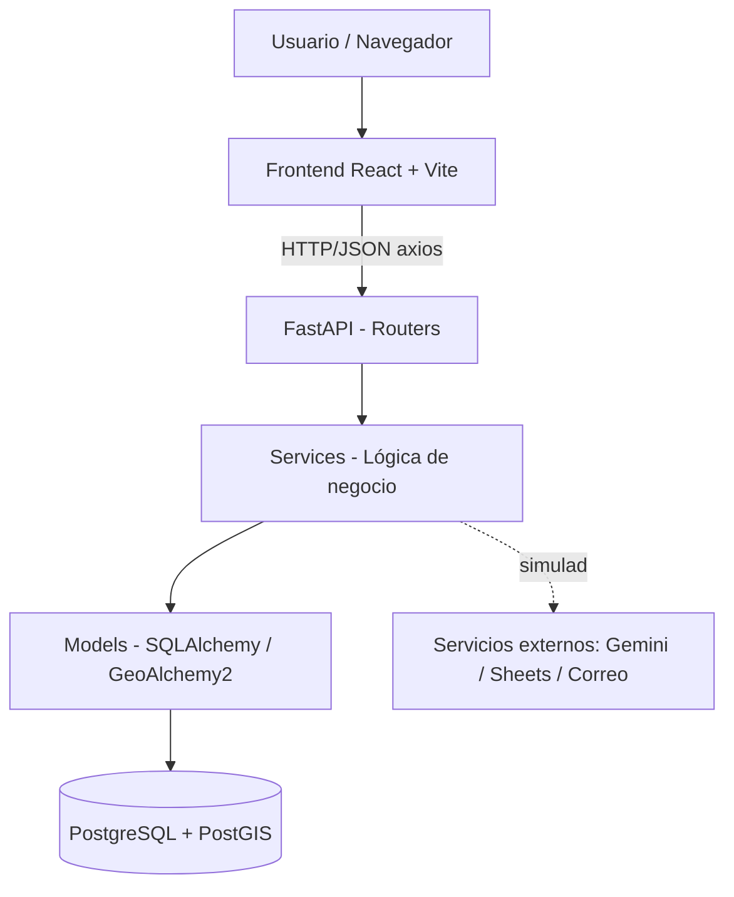

# 02 — Arquitectura Técnica

## 1. Stack tecnológico

| Capa | Tecnología | Uso |
|---|---|---|
| Frontend | React 19 + Vite + JavaScript | Interfaz de usuario (SPA) |
| Enrutado | react-router-dom | Navegación entre páginas |
| Cliente HTTP | axios | Llamadas a la API |
| i18n | react-i18next | Español por defecto, inglés futuro |
| Backend | Python + FastAPI | API REST |
| ORM | SQLAlchemy 2.0 + GeoAlchemy2 | Acceso a datos + PostGIS |
| Driver | psycopg2-binary | Conexión PostgreSQL |
| Validación | Pydantic v2 + pydantic-settings | Esquemas y configuración (.env) |
| Auth | python-jose (JWT) + passlib[bcrypt] | Tokens y hashing (coste ≥ 12) |
| Pruebas | pytest (back), Vitest (front) | Cobertura ≥ 80% / ≥ 60% |
| Base de datos | PostgreSQL + PostGIS | Datos + geolocalización |

## 2. Arquitectura en capas



## 3. Estructura del backend (`backend/app/`)

| Carpeta | Responsabilidad |
|---|---|
| `config/` | Configuración y variables de entorno (Pydantic Settings, lectura de `.env`). |
| `database/` | Conexión (engine, sesión) y base declarativa de SQLAlchemy. |
| `models/` | Modelos ORM (tablas). Reflejan el esquema SQL. |
| `schemas/` | Esquemas Pydantic (entrada/salida de la API). |
| `routers/` | Endpoints REST agrupados por dominio (usuarios, lotes, etc.). |
| `services/` | Lógica de negocio (FEFO, emparejamiento, auth, reportes). |
| `utils/` | Utilidades (seguridad, JWT, hashing, helpers). |
| `main.py` | Punto de entrada; registra routers y middlewares. |

## 4. Estructura del frontend (`frontend/src/`)

```
src/
├── main.jsx              # Punto de entrada
├── App.jsx               # Rutas principales
├── api/                  # Cliente axios y llamadas por dominio
├── components/           # Componentes reutilizables (botones, tablas...)
├── pages/                # Páginas (Login, Registro, Inventario...)
├── layouts/              # Estructura común (menú, cabecera)
├── context/              # Estado global (sesión/usuario)
├── i18n/                 # Traducciones es/en
├── styles/               # CSS y variables de la paleta
└── assets/               # Imágenes e íconos
```

## 5. Base de datos (22 tablas — resumen por dominio)

- **Identidad / acceso**: `roles`, `usuarios`, `perfiles_legales`, `direcciones_sedes`, `tokens_recuperacion_password`.
- **Catálogos**: `categorias_alimentos`, `categorias_perecibilidad`, `productos`.
- **Inventario**: `lotes_inventario`, `mermas`, `historial_estado_lote`.
- **Donaciones**: `donaciones`, `detalle_donaciones`.
- **Emparejamiento / entrega**: `emparejamientos`, `ia_ejecuciones`, `entregas_transacciones`, `evidencia_entrega`.
- **Reportes**: `reportes_consolidados`.
- **Comunicación**: `notificaciones`.
- **Cumplimiento / auditoría**: `bitacora_auditoria`, `consentimiento_datos`, `solicitudes_arco`, `retroalimentacion`.

> Extensiones requeridas: `uuid-ossp` (IDs UUID) y `postgis` (geolocalización).

## 6. Servicios externos (estrategia de simulación)

Al inicio se **simulan** para no depender de credenciales:
- **Correo**: en vez de enviar, se imprime el enlace en consola / se guarda el token.
- **Gemini IA**: se devuelve un texto de justificación de ejemplo (el motor determinista SQL/PostGIS es el que decide).
- **Google Sheets / PDF DGII**: se genera un archivo local (CSV/PDF simple) en vez de publicar en la nube.

Cada servicio se aísla en `services/` con una interfaz clara, para reemplazar la simulación por la integración real sin tocar el resto del código.

## 7. Configuración y ejecución (referencia)

- Backend: entorno `venv`, dependencias en `requirements.txt`, ejecutar con `uvicorn app.main:app --reload`.
- Frontend: `npm install`, ejecutar con `npm run dev`.
- Variables sensibles: en `backend/.env` (ejemplo en `.env.example`). Nunca subir `.env`.
