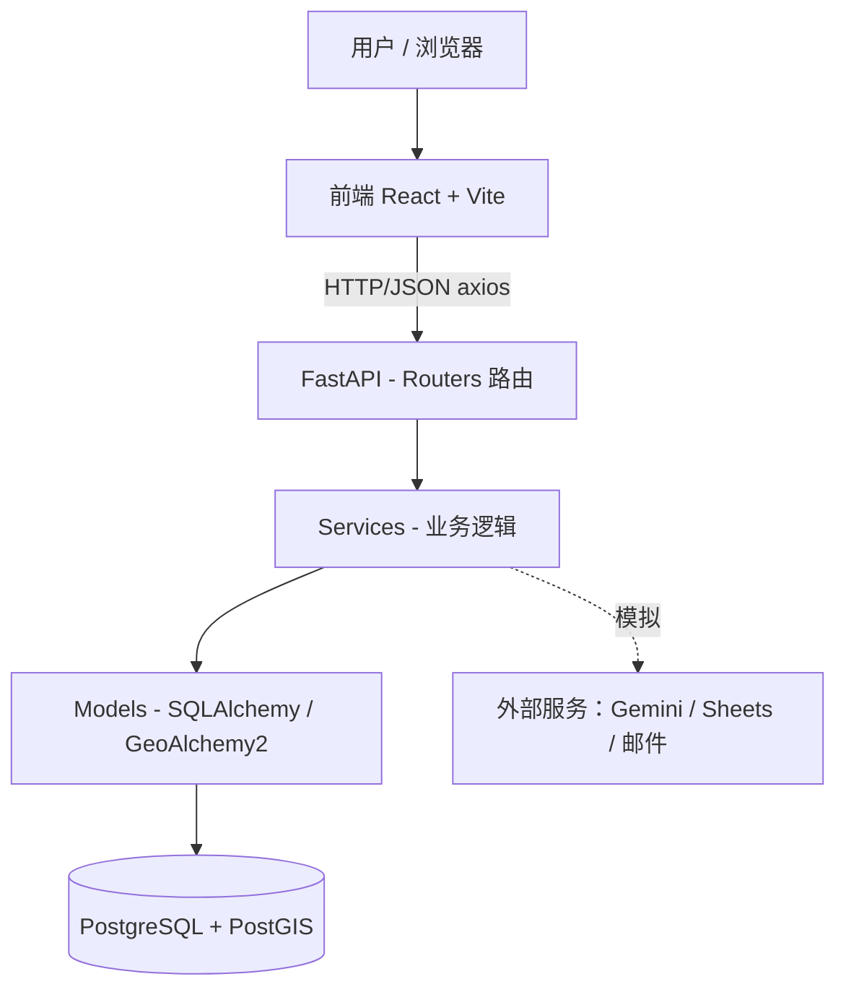

# 02 — 技术架构

> 与 [docs/es/02-arquitectura-tecnica.md](../es/02-arquitectura-tecnica.md) 对应。

## 1. 技术栈

| 层 | 技术 | 用途 |
|---|---|---|
| 前端 | React 19 + Vite + JavaScript | 用户界面（单页应用） |
| 路由 | react-router-dom | 页面导航 |
| HTTP 客户端 | axios | 调用 API |
| 国际化 | react-i18next | 默认西语，未来英语 |
| 后端 | Python + FastAPI | REST API |
| ORM | SQLAlchemy 2.0 + GeoAlchemy2 | 数据访问 + PostGIS |
| 驱动 | psycopg2-binary | 连接 PostgreSQL |
| 校验 | Pydantic v2 + pydantic-settings | 模型与配置（.env） |
| 认证 | python-jose (JWT) + passlib[bcrypt] | 令牌与哈希（成本 ≥ 12） |
| 测试 | pytest（后端）、Vitest（前端） | 覆盖率 ≥ 80% / ≥ 60% |
| 数据库 | PostgreSQL + PostGIS | 数据 + 地理定位 |

## 2. 分层架构



## 3. 后端结构（`backend/app/`）

| 文件夹 | 职责 |
|---|---|
| `config/` | 配置与环境变量（Pydantic Settings，读取 `.env`）。 |
| `database/` | 连接（engine、会话）与 SQLAlchemy 声明基类。 |
| `models/` | ORM 模型（表），对应 SQL 结构。 |
| `schemas/` | Pydantic 模型（API 输入/输出）。 |
| `routers/` | 按领域分组的 REST 端点（用户、批次等）。 |
| `services/` | 业务逻辑（FEFO、匹配、认证、报表）。 |
| `utils/` | 工具（安全、JWT、哈希、辅助函数）。 |
| `main.py` | 入口；注册路由与中间件。 |

## 4. 前端结构（`frontend/src/`）

```
src/
├── main.jsx              # 入口
├── App.jsx               # 主路由
├── api/                  # axios 客户端与各领域请求
├── components/           # 可复用组件（按钮、表格……）
├── pages/                # 页面（登录、注册、库存……）
├── layouts/              # 通用结构（菜单、页头）
├── context/              # 全局状态（会话/用户）
├── i18n/                 # es/en 翻译
├── styles/               # CSS 与配色变量
└── assets/               # 图片与图标
```

## 5. 数据库（22 张表 — 按领域分组）

- **身份/访问**：`roles`、`usuarios`、`perfiles_legales`、`direcciones_sedes`、`tokens_recuperacion_password`。
- **目录**：`categorias_alimentos`、`categorias_perecibilidad`、`productos`。
- **库存**：`lotes_inventario`、`mermas`、`historial_estado_lote`。
- **捐赠**：`donaciones`、`detalle_donaciones`。
- **匹配/交付**：`emparejamientos`、`ia_ejecuciones`、`entregas_transacciones`、`evidencia_entrega`。
- **报表**：`reportes_consolidados`。
- **通信**：`notificaciones`。
- **合规/审计**：`bitacora_auditoria`、`consentimiento_datos`、`solicitudes_arco`、`retroalimentacion`。

> 需要扩展：`uuid-ossp`（UUID 主键）与 `postgis`（地理定位）。

## 6. 外部服务（模拟策略）

初期**模拟**以免依赖凭证：
- **邮件**：不真正发送，而是在控制台打印链接/保存令牌。
- **Gemini AI**：返回示例说明文本（真正决策由 SQL/PostGIS 确定性引擎完成）。
- **Google Sheets / DGII PDF**：生成本地文件（CSV/简单 PDF）而非上传云端。

每个服务在 `services/` 中以清晰接口隔离，日后用真实集成替换模拟而无需改动其它代码。

## 7. 配置与运行（参考）

- 后端：`venv` 环境，依赖写入 `requirements.txt`，用 `uvicorn app.main:app --reload` 运行。
- 前端：`npm install`，用 `npm run dev` 运行。
- 敏感变量：放在 `backend/.env`（示例见 `.env.example`）。切勿提交 `.env`。
